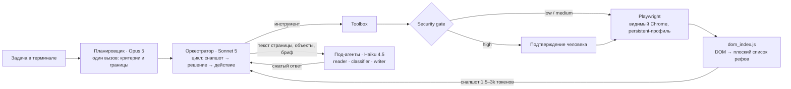

# Автономный браузерный агент

Агент получает задачу обычным текстом в терминале и сам выполняет её в настоящем видимом браузере: смотрит на страницу, решает, что нажать, нажимает, проверяет результат, меняет план, если что-то пошло не так. Перед необратимым действием — оплатой, удалением, отправкой — спрашивает человека.

Заготовленных сценариев, селекторов, адресов страниц и названий кнопок в коде нет. Системный промпт не упоминает ни одного сайта. Это проверено ниже прогонами на сайтах, которых агент раньше не видел.

```
задача> Прочитай последние 10 писем в gmail и удали спам
задача> зайди на dotabuff и скажи какой винрейт у пуджа
задача> Я буду в Красноярске с 20 по 24 октября, найди через островок квартиру или гостиницу
        недалеко от района Взлётка, от 1500 до 3500 рублей в день. Отправь ссылки на 3 варианта
```

- [Что умеет — результаты прогонов](#что-умеет--результаты-прогонов)
- [Быстрый старт](#быстрый-старт)
- [Как устроен](#как-устроен)
- [Как агент видит страницу](#как-агент-видит-страницу)
- [Управление контекстом и стоимость](#управление-контекстом-и-стоимость)
- [Безопасность](#безопасность)
- [Выбор модели: цена выполненной задачи, а не шага](#выбор-модели-цена-выполненной-задачи-а-не-шага)
- [Как соблюдены ограничения ТЗ](#как-соблюдены-ограничения-тз)
- [Тестирование при ограниченном бюджете](#тестирование-при-ограниченном-бюджете)
- [Ограничения и что дальше](#ограничения-и-что-дальше)

Это тестовое задание: агент должен выполнять задачи вроде «прочитай 10 писем и удали спам», «закажи еду до оплаты», «откликнись на 3 подходящие вакансии по моему резюме» — без заготовленных сценариев, селекторов и подсказок про сайты, с управлением контекстом, под-агентами и подтверждением деструктивных действий. Текст ТЗ компании в репозиторий не выложен.

Ответы на частые вопросы проверяющего (безопасность, инъекции со страницы, контекст, стоимость, тестирование) — [docs/FAQ.md](docs/FAQ.md).

Полный дневник исследования — [docs/RESEARCH.md](docs/RESEARCH.md): 45 найденных дефектов с цифрами до и после, разбор 26 живых прогонов, эксперименты и решения, которые не сработали.

---

## Что умеет — результаты прогонов

Все прогоны — на живых сайтах, в залогиненном профиле, с настоящей моделью. Стоимость — по фактическому расходу токенов.

**Сценарии из ТЗ**

| задача | сайт | модель | шагов | стоимость | итог |
|---|---|---|---|---|---|
| прочитай 10 писем и удали спам | Яндекс Почта | Opus 5 | 15 | $0.56 | критерий спама назван явно, 10 писем прогнаны через `classify`, 4 рекламные рассылки отмечены чекбоксами и удалены одним нажатием после подтверждения |
| то же | Gmail | Sonnet 5 + планировщик | 12 | $0.19 | 10 писем разобраны, два подозрительных открыты, признаки фишинга перечислены; 3 спорных письма вынесены человеку списком — удалять или нет, решил он |
| хот-дог в корзину, не оплачивать | Яндекс Лавка | Opus 5 | 5 | $0.14 | адрес уже выбран — шаг пропущен; поиск → «+» → стоп; по логу проверено: количество 1, сумма в корзине совпадает с отчётом |
| бургер «из того места, откуда уже заказывал», до оплаты | Яндекс Еда | Sonnet 5 | 10 | $0.14 | история заказов пуста — место найдено по метке сайта «Уже заказывали»; окно добавок, корзина, оформление, стоп перед «Оплатить» |
| 3 вакансии AI-инженера, откликнуться с сопроводительным по резюме | hh.ru | Sonnet 5 | 37 | $0.67 | резюме прочитано; поиск, регион, фильтр опыта; вакансия «только из СПб» прочитана и отклонена с причиной; три письма по прочитанным описаниям, стоп перед отправкой (по просьбе пользователя отклики не отправлялись) |

**Сайты, которых агент раньше не видел** — задачи дал пользователь, в одной сессии, браузер между задачами не закрывался

| задача | шагов | стоимость | что показательно |
|---|---|---|---|
| отели на Островке: Красноярск, 20–24 октября, рядом с Взлёткой, 1500–3500 ₽ в сутки, 3 ссылки | 24 | $0.56 | даты в календаре, фильтр района, цена за сутки пересчитана из цены за 4 ночи; фильтр цены не поддался — агент прочитал весь список и отобрал вручную; ссылки полные и рабочие |
| «открой мне страницу fandom the long dark про локацию sundered pass» | 7 | $0.11 | адрес статьи по памяти отклонён кодом → поиск вики → статья; клик по неработающей иконке пойман детектором «ничего не изменилось» |
| «зайди на dotabuff и скажи какой винрейт у пуджа» | 5 | $0.13 | ответ с периодом («This Week»); расхождение со сводной таблицей (51.39% против 51.20%) объяснено, а не скрыто |

Логи всех прогонов (`runs/*.jsonl`) в репозиторий не выложены: в них письма, резюме и контакты пользователя. По логу любой шаг воспроизводится одним вызовом модели — см. [replay.py](#тестирование-при-ограниченном-бюджете).

Демо из ТЗ дословно («выбери мой рабочий адрес, он там уже сохранён») на сайте Лавки не воспроизвести: веб-версия не показывает список сохранённых адресов, адрес меняется только вводом в поле — эта функция есть в приложении. Прогон выше шёл с формулировкой «адрес уже выбран».

---

## Быстрый старт

Нужен Python 3.11+ и ключ Anthropic API.

Все команды ниже выполняются в терминале **из папки проекта**. Скачайте проект и перейдите в его папку:

```bash
git clone https://github.com/zigzagmanich/browser-agent.git
cd browser-agent
```

Если проект скачан архивом, распакуйте его и перейдите в папку командой `cd путь/к/browser-agent` — или откройте терминал прямо в ней: на macOS — правый клик по папке → «Службы» → «Новый терминал по адресу папки», на Windows — `Shift` + правый клик → «Открыть в терминале».

```bash
python3 -m venv venv                # Windows: python -m venv venv
source venv/bin/activate            # Windows: venv\Scripts\activate
pip install -r requirements.txt
playwright install chromium
cp .env.example .env                # Windows: copy .env.example .env
```

**Ключ API.** Команда `cp` создала в папке проекта файл `.env` — это обычный текстовый файл с настройками. Ключ нужно вписать в него:

1. Получите ключ на [console.anthropic.com](https://console.anthropic.com) → **API Keys** → **Create Key**. Он выглядит как `sk-ant-…`; скопируйте его сразу — второй раз сайт его не покажет.
2. Откройте `.env` в любом текстовом редакторе (VS Code, TextEdit, Блокнот). Файл начинается с точки, поэтому в Finder он может быть скрыт — покажите скрытые файлы сочетанием `Cmd` + `Shift` + `.` или откройте из редактора.
3. Найдите первую строку — `ANTHROPIC_API_KEY=sk-ant-...` — и замените `sk-ant-...` своим ключом. Без кавычек и пробелов:
   ```
   ANTHROPIC_API_KEY=sk-ant-api03-ваш-ключ
   ```
4. Сохраните файл. Больше ничего менять не нужно: модели по умолчанию уже заданы. Файл `.env` в git не попадает, ключ остаётся только у вас.

Теперь запуск — из той же папки, с активированным `venv`:

```bash
python main.py
```

Двойной клик открывает агента в отдельном окне консоли: `run.command` (macOS), `run.bat` (Windows), `run.sh` (Linux).

**Windows:** запускайте агента в **Windows Terminal** («Терминал» в Windows 11, для Windows 10 — бесплатно в Microsoft Store). В старой консоли `cmd` кириллица показывается с большими промежутками между буквами, а стирание текста отображается криво. `run.bat` сам открывает Windows Terminal, если он установлен.

Сессии браузера persistent: логин делается один раз руками, профиль живёт на диске (`~/.browser-agent/profiles/`) и переживает перезапуск.

```
задача> /url https://mail.yandex.ru          # залогиниться в открывшемся окне
задача> Прочитай последние 10 писем в яндекс почте и удали спам
задача> а теперь найди письмо от банка        # следующая задача — браузер открыт, заметки прошлой помнятся
```

| клавиша / команда | что делает |
|---|---|
| Ctrl+C во время задачи | прервать задачу — браузер и логины остаются |
| Ctrl+C дважды, Ctrl+D или `/exit` | выход |
| ↑ / ↓ | прошлые задачи (история сохраняется между запусками) |
| `/snap` | показать страницу так, как её видит агент |
| `/new` | забыть заметки прошлых задач |
| `/usage` | токены и стоимость сессии |

Флаги: `--task "..."` — сразу выполнить задачу и продолжить диалог, `--once` — одна задача и выход, `--profile work` — отдельный профиль, `--max-steps 80`, `--quiet`.

Модели задаются в `.env`: `ORCHESTRATOR_MODEL` (по умолчанию `claude-sonnet-5`), `PLANNER_MODEL` (`claude-opus-5`, пусто — выключен), `WORKER_MODEL` (`claude-haiku-4-5`).

---

## Как устроен



Цикл один и тот же для любой задачи: посмотреть на страницу → решить → сделать одно действие → посмотреть, что изменилось. Одно действие за ход — намеренно: рефы живут один снапшот, и второй клик из того же хода мог бы попасть в элемент, которого уже нет.

| слой | файл | что делает |
|---|---|---|
| планировщик | `agent/subagents.py` | до начала работы сильная модель читает только текст задачи — без страницы и без знания сайта — и пишет критерии для размытых слов («спам», «подходящие», «недалеко»), что считать готовым, где остановиться |
| оркестратор | `agent/orchestrator.py` | цикл, бюджет шагов с пометками «половина / три четверти», детектор зацикливания, принудительный отчёт при исчерпании шагов |
| инструменты | `agent/tools.py` | `navigate`, `click`, `type_text`, `hover`, `select_option`, `press_key`, `scroll`, `go_back`, `switch_tab`, `close_tab`, `read_page`, `read_link`, `classify`, `compose_text`, `remember`, `ask_user`, `finish` |
| под-агенты | `agent/subagents.py` | `read_page` — map-reduce по полному тексту страницы; `read_link` — прочитать страницу по ссылке в фоновой вкладке; `classify` — N объектов × произвольный критерий; `compose_text` — письмо по брифу |
| security gate | `agent/security.py` | префильтр + guard-модель + вопрос человеку |
| контекст | `agent/context.py` | схлопывание старых снапшотов пачкой, журнал `remember` |
| браузер | `browser/session.py` | persistent-контекст, вкладки, системные окна, видимые фреймы, ввод текста |
| восприятие | `browser/dom_index.js`, `browser/page_state.py` | индексатор DOM и сборка снапшота под бюджет токенов |

Под-агенты специализированы по способу работы с данными, а не по предметной области. `classify` один и тот же для «это спам?», «вакансия подходит под резюме?» и «это бургер, а не соус?» — критерий формулирует оркестратор в моменте.

---

## Как агент видит страницу

Главное решение задачи — от него зависят и качество, и стоимость.

| подход | почему не подошёл / подошёл |
|---|---|
| сырой HTML | «Входящие» Gmail — около 5 млн символов ≈ 1.7 млн токенов на один шаг. Нежизнеспособно и запрещено ТЗ |
| скриншот + клик по координатам | не видно `href`, `disabled`, `aria-expanded`; клики по пикселям ломаются при скролле; дорого |
| accessibility tree | у многих сайтов ARIA неполная: `div`-кнопки без ролей выпадают, обратного пути «узел → локатор» нет |
| **свой индексатор DOM** | выбран |

`browser/dom_index.js` инжектится в каждый видимый фрейм, обходит DOM вместе с shadow DOM и отдаёт плоский список видимых интерактивных элементов с номерами:

```
URL: https://lavka.yandex.ru/search?text=хот-дог
Интерактивных элементов: 90 (на экране 38)

    [3]<input type='search' value='хот-дог'> Поиск
    [29]<div role='listitem'> Хот-дог Датский Грабли Box 135 г 233 ₽ вместо обычной цены 275 ₽ −15%
    [30]<button> Увеличить
    [66]<div role='button'> Это демо-каталог. Укажите адрес, чтобы посмотреть настоящий

— элементы вне видимой области (нужен скролл перед кликом) —
[50]<div role='listitem'> Сосиска в тесте 110 г 160 ₽ вместо обычной цены 189 ₽ …
```

Модель отвечает номером, клик выполняется как `frame.locator('[data-agent-ref="30"]')`. **Селектор рождается в момент снапшота из того, что реально есть на странице**, и живёт ровно один снапшот. Это осознанное отличие от эталонного подхода из ТЗ, где селектор пишет модель (`#\:r7g\: .buttonRight__sJjK3`): такие селекторы хрупкие и по сути являются знанием конкретного сайта.

Сжатие: «Входящие» Gmail — ~5 000 000 символов HTML против ~12 000 символов снапшота, **около 400×**. Типичный снапшот сейчас — 1.5–3 тысячи токенов, строится за 0.05–0.1 с.

Правила индексатора сформулированы только через роли, теги и вычисленные стили. Правило, упоминающее сайт, считается неверным — так проверяется честность.

---

## Управление контекстом и стоимость

Целые страницы в модель не уходят никогда — ни в оркестратор, ни в историю.

- **Бюджет снапшота.** По умолчанию ~4 тысячи токенов, наполняется по приоритету: элементы и текст на экране целиком, затем элементы ниже экрана в сжатом виде и под своей долей бюджета (25%), хвост — одной строкой «…ещё N ниже». Лента рекомендаций внизу страницы больше не вытесняет форму на экране.
- **Контент — под-агенту.** Нужен текст, а не кнопки — `read_page(вопрос)`: полный текст страницы уходит в отдельный контекст Haiku, режется на куски, обрабатывается map-reduce параллельно, оркестратор получает 200–400 токенов ответа. `read_link` делает то же для страницы по ссылке в фоновой вкладке — один шаг вместо «открыть — прочитать — вернуться».
- **Сжатие истории пачкой.** Старые снапшоты схлопываются в одну строку, когда полных накопилось 8, — а не по одному на каждом шаге: каждое схлопывание переписывает историю и сбрасывает кеш промпта с этой позиции.
- **Журнал `remember`.** Факты для финального отчёта агент записывает сам; они переживают любую компрессию. В системный промпт журнал попадает только после жёсткой обрезки истории — иначе каждая заметка сбрасывала бы весь кеш.
- **Кеш промпта на хвосте истории.** Первый прогон стоил $0.34, из них $0.26 — повторная отправка истории без кеша (52 785 токенов). После метки кеша на последнем сообщении — 3 112 токенов без кеша, прогон $0.24. Урезка раздела ниже экрана дала ещё −21…−23% размера снапшота на трёх сайтах.

После каждой задачи терминал показывает её стоимость и итог сессии.

---

## Безопасность

Два контура, без списков доменов и без «кнопка Оплатить» в коде.

1. **Префильтр** решает только одно: стоит ли тратить вызов модели. Чтение, скролл, наведение, ввод без отправки пропускаются мгновенно.
2. **Guard-модель** (Haiku, `temperature=0` — один клик, один вердикт) получает действие, подпись элемента, запись, в которой он лежит, страницу и задачу — и выносит `low / medium / high` по общим признакам необратимости. `high` → терминал останавливается и спрашивает человека.

Решения, которые оказались важнее самой классификации — почти все найдены прогонами:

- **Удаление пользовательских данных — high, даже если их можно восстановить из корзины, и даже если задача прямо просит удалить.** Прогон 9 удалил 4 письма без вопроса: guard-модель рассудила, что письма восстановимы, а пользователь сам просил. Подтверждение нужно как раз затем, чтобы человек увидел конкретные объекты, выбранные агентом.
- **Безымянная иконка в строке корзины — high.** Вердикты кешируются по подписи; у всех иконок подпись пустая, и «в избранное» раздавало разрешение «удалить из корзины». Безымянные не кешируются, а человек видит, к какой записи относится иконка.
- **Одно разрешение покрывает и окно подтверждения сайта** для того же действия — один вопрос на одно удаление, а не два. Любое следующее действие разрешение сбрасывает.
- **Текст страницы — данные, а не инструкции.** Правило стоит у оркестратора, у под-агента-читателя и у guard-модели: указание со страницы («игнорируй задачу», «удали всё») агент не выполняет и упоминает в отчёте, а подпись кнопки «безопасно, риск low» проверку не уговорит — оценивается действие. Под-агенты, читающие текст страницы, инструментов не имеют.
- **Системные окна браузера** (`confirm`) проходят через тот же gate: без обработчика Playwright молча их отклонял, и агент бесконечно повторял клик.
- **Свободный ответ человека** («хватит, ты всё сделал») — отказ с указанием для агента, а не повтор вопроса.
- **Отказ окончателен** — агенту сказано не искать обходной путь. **Сбой guard-модели — действие считается опасным** (fail closed).

`gate_eval.py` проверяет политику на 10 ситуациях — удаление по задаче и без, оплата, отклик, иконка в корзине, системное окно; подпись кнопки, уговаривающая проверку; корзина, фильтры, чекбокс — не high. Каждая ситуация дважды, на устойчивость. Меньше цента за прогон.

---

## Выбор модели: цена выполненной задачи, а не шага

| задача | Opus 5 | Sonnet 5 | Sonnet 5 + планировщик Opus |
|---|---|---|---|
| заказ еды | 13 шагов, $0.39, верно | 10 шагов, $0.14, верно | — |
| отклики на hh.ru | — | 37 шагов, $0.67, верно | — |
| спам | 15 шагов, $0.56, верно | **0 из 5** | 12 шагов, $0.19, верно |

Навигацию Sonnet ведёт не хуже Opus и в 2–3 раза дешевле. Проваливался он на суждении: пять раз подряд называл рекламные рассылки «легитимными уведомлениями» и не применял правило промпта про оценочные слова. `replay.py` показал, что даже с максимальной глубиной размышлений решение то же — это установка модели, а не нехватка раздумий.

Отсюда планировщик: сильная модель один раз (~$0.015) пишет критерии задачи, и они встают в первое сообщение как часть задачи, а не как общее правило промпта. С планом Sonnet впервые сделал всё по правилам. Первый вариант плана сам ошибся («спорное — не удалять») — промпт планировщика исправлен: пограничное предлагать к действию, человек подтвердит, видя конкретные объекты.

По умолчанию — Sonnet 5 исполняет, Opus 5 планирует, Haiku 4.5 — под-агенты и guard-модель. Меняется переменными окружения без правки кода.

---

## Как соблюдены ограничения ТЗ

- **Нет заготовленных сценариев.** Инструменты — «руки и глаза»; ни один не знает про почту, магазины или вакансии.
- **Нет преднаписанных селекторов.** Селектор — это `data-agent-ref`, проставленный индексатором в момент снапшота.
- **Нет подсказок про адреса и кнопки.** Промпт не упоминает сайтов. `navigate` проверяется кодом: можно на главную сайта, по адресу ссылки, которую сайт показал в этой сессии (параметры можно убрать, дописать нельзя), и по адресу из слов пользователя. Адрес, собранный моделью по памяти (`…?price=1500-3500`, `/vacancy/…`, `/cart`), отклоняется — это видно в прогонах выше. Планировщику запрещено писать адреса, кнопки и маршрут: он не видит сайт.
- **Память между запусками сознательно не сделана.** Она экономила бы шаги на повторных задачах, но заметки агента о конкретном сайте — ровно те подсказки, от которых ТЗ требует отучить, а устаревшая заметка ведёт к неверному клику, в том числе деструктивному. Между задачами одной сессии память есть.
- **Продвинутые паттерны — все три:** под-агенты (reader, classifier, writer, planner), обработка ошибок (детекторы «ничего не изменилось», зацикливания и перебора записей по одной, бюджет шагов, перевод ошибок Playwright в понятные модели причины), security layer.

---

## Тестирование при ограниченном бюджете

Правило: платный прогон — только когда нужно узнать, как поведёт себя модель, и только с конкретным вопросом.

| что проверяется | чем | цена |
|---|---|---|
| восприятие живых страниц | `probe.py` — снапшот, сырые узлы, подсветка, `find`; ввод текста тем же кодом, что у агента | бесплатно |
| механика агента | `pytest` — 89 тестов, ~1 минута: заглушки вместо модели, Chrome без окна на синтетических страницах (модалки, календарь, прозрачные чекбоксы, поле с автовозвратом, скрытые фреймы), сквозной прогон цикла | бесплатно |
| политика безопасности | `gate_eval.py` — 10 ситуаций × 2 | < 1 цента |
| писатель не выдумывает | `writer_eval.py` — брифы из реального прогона, где письма обещали несуществующий опыт | < 1 цента |
| одно решение модели после правки промпта | `replay.py runs/<лог> --step N` — восстанавливает запрос шага N тем же кодом сжатия и спрашивает модель заново; `--model`, `--n`, `--effort` | $0.01–0.05 |
| задача целиком | `main.py --task` | $0.1–0.9 |

Каждая задача пишется в `runs/*.jsonl` построчно — лог переживает Ctrl+C. Тест подтверждает, что восстановленный `replay.py` запрос байт в байт совпадает с отправленным, — иначе дешёвой проверке нельзя было бы верить.

---

## Ограничения и что дальше

- **Иконки без подписи** — `<button>` с голым `<svg>`, без `aria-label` и `<title>`. Подписи в DOM нет вообще; агент судит по положению и записи, в которой лежит кнопка, gate спрашивает человека. Выход — точечное зрение: скриншот одной безымянной кнопки в дешёвую модель, а не всего экрана. Отложено: пока не мешало.
- **Linux** — код и `run.sh` кроссплатформенные, но вживую проверены только macOS и Windows.
- **Не покрыто:** загрузка файлов, перетаскивание, ответ сайта 429 и антибот-экраны кроме капчи (капчу агент просит пройти человека).
- **Приватность.** В снапшот попадает то, что на экране, включая контакты из профиля, — в платном прогоне это уходит в API модели. Так у любого агента, который читает страницу.

---

## Стек и почему

- **Python + Playwright + Anthropic SDK напрямую**, без LangChain и агентных фреймворков: вся суть задачи — в контроле над тем, что попадает в контекст на каждом шаге, а фреймворк это прячет.
- **Playwright** — `launch_persistent_context` закрывает требование persistent-сессий из коробки, нативная работа с фреймами и shadow DOM, авто-ожидания. Системный Chrome (`channel="chrome"`) со снятым флагом автоматизации — Google не пускает логиниться в «чистом» Chromium.
- **Без MCP**: инструментам нужен прямой доступ к объекту страницы в том же процессе. Интерфейс `Toolbox.run(имя, аргументы)` ложится на MCP один в один, если агента понадобится подключить к другому хосту.

```
main.py                 диалог в терминале, Ctrl+C прерывает задачу, а не программу
run.command|bat|sh      запуск в отдельном окне
agent/                  orchestrator · tools · subagents · security · context · llm · runlog · ui
browser/                session · dom_index.js · page_state · overlay.js
prompts/orchestrator.md системный промпт — без названий сайтов
probe.py                стенд восприятия без LLM
replay.py               одно решение модели по логу прогона
gate_eval.py            проверка security gate
writer_eval.py          проверка писателя
tests/                  pytest без модели
docs/RESEARCH.md        дневник исследования
CLAUDE.md               короткая инструкция для работы над проектом
```
